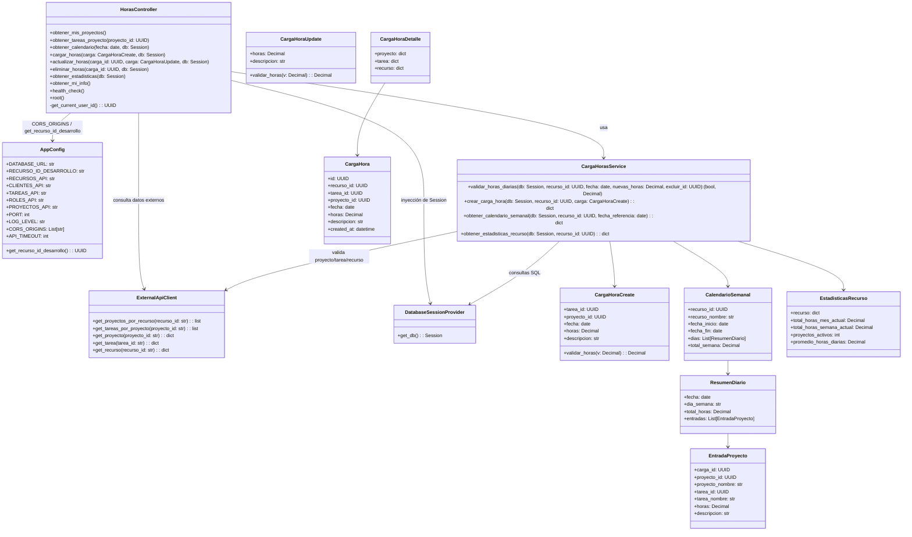

# Diagrama de Código - [Modulo de Carga de Horas PSA]

## Información del Documento

| Campo | Valor |
|-------|-------|
| **Módulo** | [Carga de Horas PSA] |
| **Squad** | [Squad 3] |
| **Fecha de creación** | [20/11/2025] |
| **Última actualización** | [20/11/2025] |

## Diagrama de Código (C4 Nivel 4)

*Diagrama de código del módulo [Nombre del módulo] mostrando las clases principales y sus relaciones*

## Descripción de Clases

### Controladores
| Clase | Responsabilidades | Métodos Principales |
|-------|------------------|-------------------|
| [HorasController (módulo main.py)] | [Orquestar los endpoints HTTP de la API de carga de horas (FastAPI): proyectos, tareas, calendario, altas/bajas/modificaciones de horas, estadísticas, health check e información del usuario actual. Aplica validaciones de autorización por recurso (dueño de la carga).] | [obtener_mis_proyectos, obtener_tareas_proyecto, obtener_calendario, cargar_horas, actualizar_horas, eliminar_horas, obtener_estadisticas, obtener_mi_info, health_check, root] |

### Servicios
| Clase | Responsabilidades | Métodos Principales |
|-------|------------------|-------------------|
| [CargaHorasService (módulo services.py)] | [Encapsular la lógica de negocio de la carga de horas: validación de tope de 24 horas diarias, validación de existencia y relación proyecto–tarea–recurso contra APIs externas, inserción/consulta de datos en la tabla carga_horas, armado de calendario semanal y cálculo de estadísticas por recurso.] | [validar_horas_diarias, crear_carga_hora, obtener_calendario_semanal, obtener_estadisticas_recurso] |
| [AppConfig (módulo config.py)] | [Centralizar configuración de la aplicación: conexión a BD, IDs y URLs de APIs externas, parámetros de CORS, logging, puerto y timeout. Exponer el recurso_id de desarrollo.] | [get_recurso_id_desarrollo] |

### Repositorios
| Clase | Responsabilidades | Métodos Principales |
|-------|------------------|-------------------|
| [UserRepository] | [Acceso a datos] | [save, findById, findAll, deleteById] |

### Entidades
| Clase | Responsabilidades | Atributos Principales |
|-------|------------------|---------------------|
| [CargaHoraCreate] | [Modelo de entrada para creación de cargas de horas. Valida rangos de horas (0 < horas ≤ 24) y redondea a 2 decimales.] | [tarea_id, proyecto_id, fecha, horas, descripcion] |
| [CargaHoraUpdate] | [Modelo de entrada para actualización parcial de una carga (horas y/o descripción).] | [horas, descripcion] |
| [CargaHora] | [Modelo de respuesta base para una carga de horas persistida en BD.] | [id, recurso_id, tarea_id, proyecto_id, fecha, horas, descripcion, created_at] |
| [CargaHoraDetalle] | [Extiende CargaHora agregando información enriquecida de APIs externas (proyecto, tarea, recurso).] | [Hereda atributos de CargaHora + proyecto, tarea, recurso] |
| [EntradaProyecto] | [Representa una entrada de horas por proyecto/tarea dentro de un día del calendario.] | [carga_id, proyecto_id, proyecto_nombre, tarea_id, tarea_nombre, horas, descripcion] |
| [ResumenDiario] | [Agrega y agrupa las horas de un día: total diario y lista de entradas por proyecto/tarea.] | [fecha, dia_semana, total_horas, entradas] |
| [CalendarioSemanal] | [Modelo de respuesta para el calendario semanal completo de un recurso (lunes a domingo).] | [recurso_id, recurso_nombre, fecha_inicio, fecha_fin, dias, total_semana] |
| [EstadisticasRecurso] | [Modelo de respuesta para las estadísticas de un recurso (mes, semana, proyectos activos, promedio).] | [recurso, total_horas_mes_actual, total_horas_semana_actual, proyectos_activos, promedio_horas_diarias] |

## Patrones de Diseño Utilizados

### Capa de Servicio (Service Layer)
Toda la lógica de negocio relacionada con la carga de horas está centralizada en `CargaHorasService`.  
Los endpoints actúan como orquestadores y delegan validaciones y reglas de negocio al servicio.

### DTOs / Modelos de Validación con Pydantic
Los modelos de `models.py` (`CargaHoraCreate`, `CargaHoraUpdate`, `CalendarioSemanal`, etc.) se utilizan para validar y tipar entradas/salidas de la API, asegurando contratos claros entre frontend y backend.

### Inyección de dependencias (FastAPI)
El acceso a BD (`get_db`) y el usuario actual (`get_current_user_id`) se resuelven como dependencias, desacoplando la capa de presentación de los detalles de infraestructura.

### Cliente externo especializado
El acceso a las APIs externas se centraliza en `external_apis.api_client`, evitando que la capa de presentación y servicios tengan lógica duplicada de consumo HTTP.

## Notas Adicionales

[Información adicional sobre la estructura de código, convenciones de naming, o cualquier detalle relevante]

---

**Versión:** 1.0  
**Estado:** [Borrador/En revisión/Aprobado]
