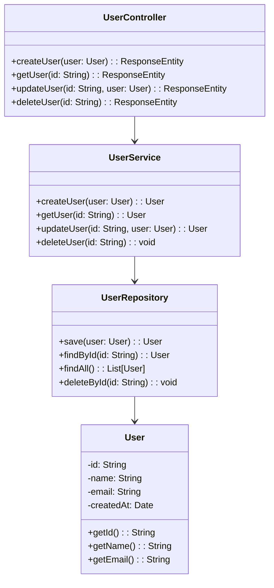

# Diagrama de Código - [Nombre del Módulo]

## Información del Documento

| Campo | Valor |
|-------|-------|
| **Módulo** | [Nombre del módulo] |
| **Squad** | [Nombre del squad] |
| **Fecha de creación** | [DD/MM/YYYY] |
| **Última actualización** | [DD/MM/YYYY] |

## Diagrama de Código (C4 Nivel 4)

*Diagrama de código del módulo [Nombre del módulo] mostrando las clases principales y sus relaciones*

## Descripción de Clases

### Controladores
| Clase | Responsabilidades | Métodos Principales |
|-------|------------------|-------------------|
| [UserController] | [Manejo de requests HTTP] | [createUser, getUser, updateUser, deleteUser] |

### Servicios
| Clase | Responsabilidades | Métodos Principales |
|-------|------------------|-------------------|
| [UserService] | [Lógica de negocio] | [createUser, getUser, updateUser, deleteUser] |

### Repositorios
| Clase | Responsabilidades | Métodos Principales |
|-------|------------------|-------------------|
| [UserRepository] | [Acceso a datos] | [save, findById, findAll, deleteById] |

### Entidades
| Clase | Responsabilidades | Atributos Principales |
|-------|------------------|---------------------|
| [User] | [Representación de usuario] | [id, name, email, createdAt] |

## Patrones de Diseño Utilizados

- **MVC (Model-View-Controller):** Separación de responsabilidades
- **Repository Pattern:** Abstracción del acceso a datos
- **Service Layer:** Encapsulación de lógica de negocio

## Notas Adicionales

[Información adicional sobre la estructura de código, convenciones de naming, o cualquier detalle relevante]

---

**Versión:** 1.0  
**Estado:** [Borrador/En revisión/Aprobado]
