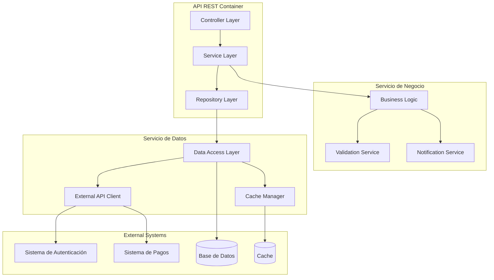

# Diagrama de Componentes - [Nombre del Módulo]

## Información del Documento

| Campo | Valor |
|-------|-------|
| **Módulo** | [Nombre del módulo] |
| **Squad** | [Nombre del squad] |
| **Fecha de creación** | [DD/MM/YYYY] |
| **Última actualización** | [DD/MM/YYYY] |

## Diagrama de Componentes (C4 Nivel 3)

*Diagrama de componentes del módulo [Nombre del módulo] mostrando la estructura interna de componentes*

## Descripción de Componentes

### Capa de Controladores
| Componente | Responsabilidades | Tecnología |
|------------|------------------|------------|
| [Controller Layer] | [Manejo de requests HTTP] | [Spring MVC/Express.js/etc.] |

### Capa de Servicios
| Componente | Responsabilidades | Tecnología |
|------------|------------------|------------|
| [Business Logic] | [Lógica de negocio principal] | [Java/Python/etc.] |
| [Validation Service] | [Validación de datos] | [Java/Python/etc.] |
| [Notification Service] | [Envío de notificaciones] | [Java/Python/etc.] |

### Capa de Acceso a Datos
| Componente | Responsabilidades | Tecnología |
|------------|------------------|------------|
| [Data Access Layer] | [Acceso a base de datos] | [JPA/Hibernate/etc.] |
| [Cache Manager] | [Gestión de caché] | [Redis/Memcached] |
| [External API Client] | [Comunicación con APIs externas] | [RestTemplate/Feign/etc.] |

## Interacciones entre Componentes

| Origen | Destino | Tipo | Descripción |
|--------|---------|------|-------------|
| [Controller Layer] | [Business Logic] | [Llamada directa] | [Delegación de lógica de negocio] |
| [Business Logic] | [Data Access Layer] | [Llamada directa] | [Acceso a datos] |
| [External API Client] | [Sistema Externo] | [HTTP/REST] | [Comunicación con servicios externos] |

## Notas Adicionales

[Información adicional sobre la arquitectura de componentes, patrones de diseño utilizados, o cualquier detalle relevante]

---

**Versión:** 1.0  
**Estado:** [Borrador/En revisión/Aprobado]
