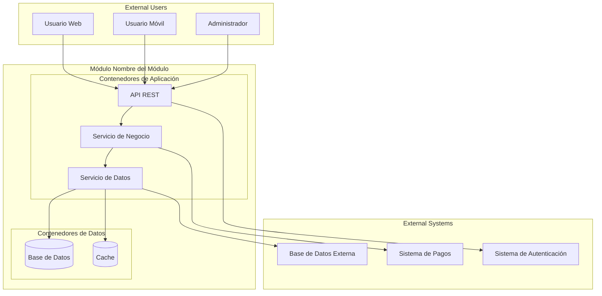

# Diagrama de Contenedores - [Nombre del Módulo]

## Información del Documento

| Campo | Valor |
|-------|-------|
| **Módulo** | [Nombre del módulo] |
| **Squad** | [Nombre del squad] |
| **Fecha de creación** | [DD/MM/YYYY] |
| **Última actualización** | [DD/MM/YYYY] |

## Diagrama de Contenedores (C4 Nivel 2)

*Diagrama de contenedores del módulo [Nombre del módulo] mostrando la arquitectura de contenedores*

## Descripción de Contenedores

### Contenedores de Aplicación

| Contenedor | Tecnología | Responsabilidades |
|-------------|------------|------------------|
| [API REST] | [Node.js/Spring Boot/etc.] | [Exposición de endpoints REST] |
| [Servicio de Negocio] | [Java/Python/etc.] | [Lógica de negocio] |
| [Servicio de Datos] | [Java/Python/etc.] | [Acceso a datos] |

### Contenedores de Datos

| Contenedor | Tecnología | Responsabilidades |
|-------------|------------|------------------|
| [Base de Datos] | [PostgreSQL/MySQL/MongoDB] | [Almacenamiento persistente] |
| [Cache] | [Redis/Memcached] | [Almacenamiento temporal] |

## Interacciones entre Contenedores

| Origen | Destino | Protocolo | Descripción |
|--------|---------|-----------|-------------|
| [API REST] | [Servicio de Negocio] | [HTTP/REST] | [Solicitudes de lógica de negocio] |
| [Servicio de Negocio] | [Servicio de Datos] | [HTTP/gRPC] | [Acceso a datos] |
| [Servicio de Datos] | [Base de Datos] | [SQL/NoSQL] | [Consultas y transacciones] |

## Notas Adicionales

[Información adicional sobre la arquitectura de contenedores, consideraciones técnicas, o cualquier detalle relevante]

---

**Versión:** 1.0  
**Estado:** [Borrador/En revisión/Aprobado]
