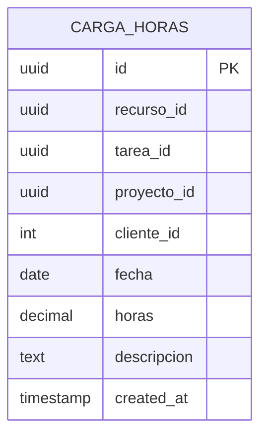

# Diseño de Base de Datos - [Modulo de Carga de Horas]

## Información del Documento

| Campo | Valor |
|-------|-------|
| **Módulo** | [Carga de horas] |
| **Squad** | [Squad 3] |
| **Fecha de creación** | [20/11/2025] |
| **Última actualización** | [20/11/2025] |

## Diagrama Entidad-Relación

*Diagrama entidad-relación del módulo [Nombre del módulo]*

## Descripción de Entidades

### [CARGA_HORAS]
- **Descripción:** [Registro de horas trabajadas por recurso sobre una tarea y proyecto determinados.]
- **Propósito:** [Persistir de forma normalizada las horas cargadas por cada recurso en una fecha, asociadas a identificadores provenientes de una API externa (recurso, tarea, proyecto y cliente), aplicando validaciones de negocio (no más de 24 horas por día por recurso).]
- **Atributos principales:** [- **id:** Identificador único de la carga.  
- **recurso_id:** ID del recurso en sistema externo.  
- **tarea_id:** ID de la tarea en el sistema externo.  
- **proyecto_id:** ID del proyecto externo.  
- **cliente_id:** ID del cliente externo (opcional).  
- **fecha:** Fecha de trabajo registrado.  
- **horas:** Horas cargadas.  
- **descripcion:** Detalle de la actividad.  
- **created_at:** Timestamp del registro.]

## Relaciones entre Entidades

| Entidad Origen | Relación | Entidad Destino | Cardinalidad | Descripción |
|----------------|----------|-----------------|--------------|-------------|
| CARGA_HORAS | Referencia lógica | API externa (recurso/tarea/proyecto/cliente) | 1:N | Los IDs apuntan a datos externos; no se definen FKs. |

## Diccionario de Datos

| Entidad | Atributo | Descripción | Tipo | Restricciones |
|---------|----------|-------------|------|---------------|
| CARGA_HORAS | id | Identificador único | UUID | PK, DEFAULT gen_random_uuid() |
| CARGA_HORAS | recurso_id | Recurso externo | UUID | NOT NULL, indexado |
| CARGA_HORAS | tarea_id | Tarea externa | UUID | NOT NULL |
| CARGA_HORAS | proyecto_id | Proyecto externo | UUID | NOT NULL, indexado |
| CARGA_HORAS | cliente_id | Cliente externo | INTEGER | NULL |
| CARGA_HORAS | fecha | Fecha de carga | DATE | NOT NULL, indexado |
| CARGA_HORAS | horas | Horas cargadas | DECIMAL(5,2) | CHECK (horas > 0 AND horas <= 24) |
| CARGA_HORAS | descripcion | Detalle | TEXT | NULL |
| CARGA_HORAS | created_at | Fecha de registro | TIMESTAMP | DEFAULT CURRENT_TIMESTAMP |

## Consideraciones Técnicas

### Tecnología de Base de Datos
- **SGBD:** [PostgreSQL]
- **Versión:** [Versión específica]
- **Configuración:** [Extension pgcrypto para generacion de UUID]

### Índices
| Tabla       | Columna(s)        | Tipo   | Propósito                               |
| ----------- | ----------------- | ------ | --------------------------------------- |
| carga_horas | recurso_id        | B-tree | Consultas por recurso                   |
| carga_horas | fecha             | B-tree | Consultas por fecha                     |
| carga_horas | proyecto_id       | B-tree | Consultas por proyecto                  |
| carga_horas | recurso_id, fecha | B-tree | Soporte para trigger y reportes diarios |

### Restricciones
- **Claves Primarias:** [Id]
- **Claves Foráneas:** [Lista de claves foráneas]
- **Índices Únicos:** [Lista de índices únicos]

## Notas Adicionales

[El trigger implementa la regla de negocio principal del módulo.]

---

**Versión:** 1.0  
**Estado:** [Borrador/En revisión/Aprobado]
