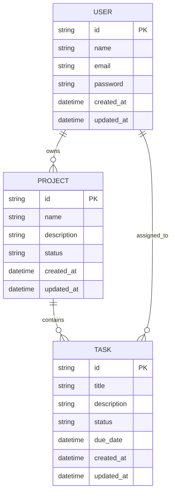

# Diseño de Base de Datos - [Nombre del Módulo]

## Información del Documento

| Campo | Valor |
|-------|-------|
| **Módulo** | [Nombre del módulo] |
| **Squad** | [Nombre del squad] |
| **Fecha de creación** | [DD/MM/YYYY] |
| **Última actualización** | [DD/MM/YYYY] |

## Diagrama Entidad-Relación

*Diagrama entidad-relación del módulo [Nombre del módulo]*

## Descripción de Entidades

### [Entidad 1]
- **Descripción:** [Descripción de la entidad]
- **Propósito:** [Propósito de la entidad en el sistema]
- **Atributos principales:** [Lista de atributos clave]

### [Entidad 2]
- **Descripción:** [Descripción de la entidad]
- **Propósito:** [Propósito de la entidad en el sistema]
- **Atributos principales:** [Lista de atributos clave]

### [Entidad 3]
- **Descripción:** [Descripción de la entidad]
- **Propósito:** [Propósito de la entidad en el sistema]
- **Atributos principales:** [Lista de atributos clave]

## Relaciones entre Entidades

| Entidad Origen | Relación | Entidad Destino | Cardinalidad | Descripción |
|----------------|----------|-----------------|--------------|-------------|
| [Entidad A] | [Tipo de relación] | [Entidad B] | [1:1, 1:N, N:M] | [Descripción de la relación] |
| [Entidad B] | [Tipo de relación] | [Entidad C] | [1:1, 1:N, N:M] | [Descripción de la relación] |

## Diccionario de Datos

| Entidad | Atributo | Descripción | Tipo | Restricciones |
|---------|----------|-------------|------|---------------|
| [Entidad 1] | [Atributo 1] | [Descripción del atributo] | [VARCHAR/INT/DATE] | [NOT NULL/UNIQUE/etc.] |
| [Entidad 1] | [Atributo 2] | [Descripción del atributo] | [VARCHAR/INT/DATE] | [NOT NULL/UNIQUE/etc.] |
| [Entidad 2] | [Atributo 1] | [Descripción del atributo] | [VARCHAR/INT/DATE] | [NOT NULL/UNIQUE/etc.] |

## Consideraciones Técnicas

### Tecnología de Base de Datos
- **SGBD:** [PostgreSQL/MySQL/MongoDB/etc.]
- **Versión:** [Versión específica]
- **Configuración:** [Configuraciones especiales]

### Índices
| Tabla | Columna | Tipo | Propósito |
|-------|---------|------|-----------|
| [Tabla 1] | [Columna 1] | [B-tree/Hash] | [Optimización de consultas] |
| [Tabla 2] | [Columna 2] | [B-tree/Hash] | [Optimización de consultas] |

### Restricciones
- **Claves Primarias:** [Lista de claves primarias]
- **Claves Foráneas:** [Lista de claves foráneas]
- **Índices Únicos:** [Lista de índices únicos]

## Notas Adicionales

[Información adicional sobre el diseño de base de datos, consideraciones de rendimiento, o cualquier detalle relevante]

---

**Versión:** 1.0  
**Estado:** [Borrador/En revisión/Aprobado]
