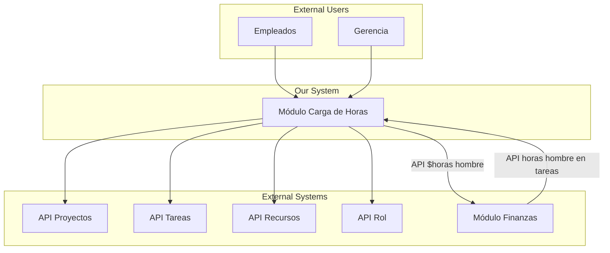

# Diagrama de Contexto - Carga de horas

## Información del Documento

| Campo | Valor |
|-------|-------|
| **Módulo** | Carga de horas |
| **Squad** | Squad 3 |
| **Fecha de creación** | 06/11/2025 |
| **Última actualización** | 06/11/2025 |

## Diagrama de Contexto (C4 Nivel 1)

*Diagrama de contexto del módulo "carga de horas" mostrando las interacciones con usuarios y sistemas externos*

## Descripción del Sistema

### Sistema Principal
- **Nombre:** Carga de horas
- **Propósito:** Permitir declarar horas trabajadas en tareas
- **Responsabilidades:** Registrar las horas trabajadas en una fecha y tarea en particular
    -- Reporte semanal de un recurso de la cantidad de horas que dedico a cada tarea para cada día de la semana
    -- Reporte mensual de costos discriminando por recurso en un proyecto

### Usuarios Externos
| Usuario | Descripción | Interacciones |
|---------|-------------|---------------|
| Empleado | Desarrolladores, ingenieros de soporte | Cargaran sus horas en las tareas |
| Gerencia | Son los lideres de proyectos, jefe de soporte, jefes de operaciones | Obtendran los reportes semanales y mensuales|

### Sistemas Externos
| Sistema | Descripción | Tipo de Interacción |
|---------|-------------|-------------------|
| API proyectos | Contiene nombre y descripción del proyecto | API |
| API tareas | Contiene nombre, descripción, el id del recurso y el id del proyecto | API |
| API recursos | Contiene nombre, apellido, dni y el id del rol | API |
| API rol | Contiene nombre del rol y la experiencia | API |

## Notas Adicionales

[Información adicional sobre el contexto del sistema, consideraciones técnicas, o cualquier detalle relevante]

---

**Versión:** 1.0  
**Estado:** En revisión
