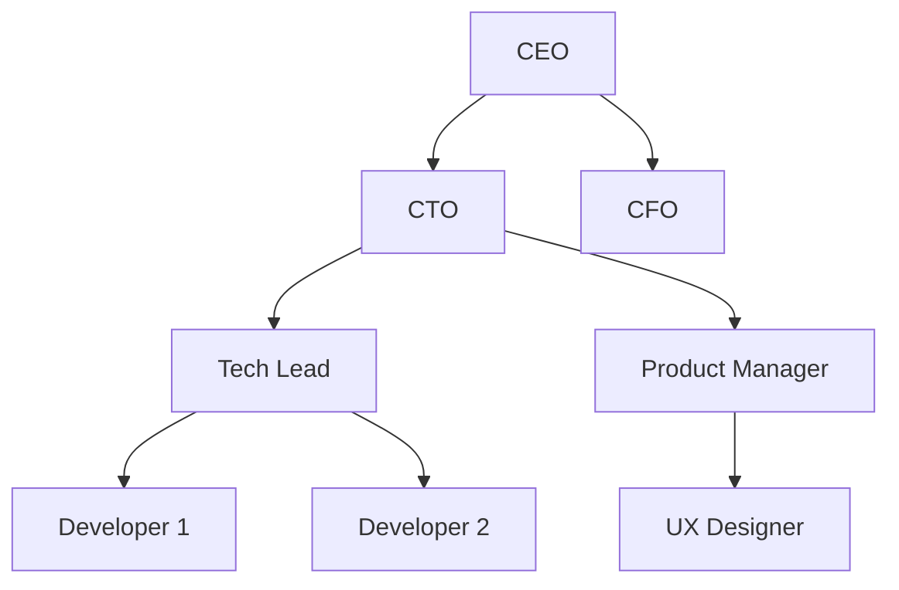

# Organigrama - [Nombre del Módulo]

## Información del Documento

| Campo | Valor |
|-------|-------|
| **Módulo** | [Nombre del módulo] |
| **Squad** | [Nombre del squad] |
| **Fecha de creación** | [DD/MM/YYYY] |
| **Última actualización** | [DD/MM/YYYY] |

## Diagrama Organizacional

*Diagrama de la estructura organizacional para el módulo [Nombre del módulo]*

## Roles Principales

| Rol | Responsabilidades |
|-----|------------------|
| [Rol 1] | [Descripción breve] |
| [Rol 2] | [Descripción breve] |
| [Rol 3] | [Descripción breve] |

## Notas Adicionales

[Información adicional sobre la estructura organizacional o consideraciones especiales]

---

**Versión:** 1.0  
**Estado:** [Borrador/En revisión/Aprobado]